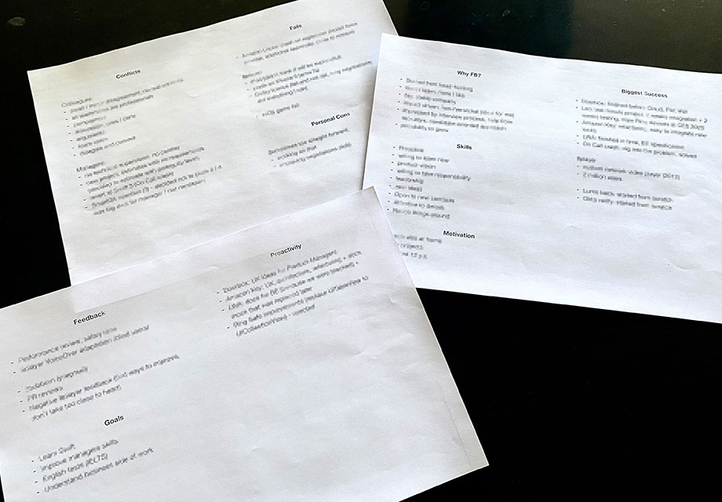

## Facebook

### What to Expect (min number of interviews):

### Career/Coding

You'll be meeting with an engineer who will be interested in learning about your choices and hopes for your career (trajectory), where your passions are in technology, desire for impact, why Facebook, and even possibly things you'd change/improve about Facebook. It always helps to read current news articles/blogs about Facebook for these interviews. There will also be a short coding element in this interview followed by Q&A for any questions you might have about projects, impact, etc!

### Coding (2)

Our coding interviews are similar to your initial interview. We are looking for accurate, bug-free, fast, and well-thought-out code. Your interviewers will be looking for your thought process, so be sure to provide a narrative as you go through the code. As before, you’re welcome to code in whatever language you feel most comfortable with, but choosing one that is going to assist in getting an optimal solution in the speediest and most efficient manner is key.

### Design (2)

The design interview focuses on systems - think distributed systems and APIs. You may be asked to build a feature for Facebook. Our engineer will be focusing on your ability to think through the design of a complex system, especially with regards to tradeoffs around consistency, availability, and partition tolerance. I’ve attached a document that goes more in depth.

* [How NOT to design Netflix in your 45-minute System Design Interview? | Hacker Noon](https://hackernoon.com/how-not-to-design-netflix-in-your-45-minute-system-design-interview-64953391a054#.phar9zd9h)

* [Preparing for your Software Engineering Interview at Facebook | Facebook Careers](https://www.facebook.com/careers/life/preparing-for-your-software-engineering-interview-at-facebook?__mref=message_bubble)

* [Get that job at Facebook](https://www.facebook.com/notes/facebook-engineering/get-that-job-at-facebook/10150964382448920)

* [Sample Interview Questions & Solutions](https://www.facebook.com/careers/life/sample_interview_questions/?redirect_id=Af9Mmfz-HbPISty9nQR6yKxtivN1whrPuXGhuQAbYBhq_SegEYs5Xt4u5ETdhxDV7j8&loop_id=Af9Jba-YGmcXNttt8I_dl9JuLiKFS_YMXRMIDRb1wOLqSZONlFoUer58GShAGO6LgFH--BSF0duY5PizjhTEG4Gy)

### Read papers:

* [Scaling Memcache at Facebook](https://www.usenix.org/system/files/conference/nsdi13/nsdi13-final170_update.pdf&sa=U&ei=gWJjU97pOeqxsQSDkYDAAg&ved=0CBsQFjAA&usg=AFQjCNGMeuWne9ywncbgux_XiZW6lQWHNw)

# Microsoft

### Software Design Prep

Often times, software systems need software components, something to store data, something to make decisions (such as business logic) and APIs or processes. Reviewing software systems design diagrams (especially SOA or distributed software systems) can be helpful for preparation.

Scaling is a critical component of software design at Microsoft. It’s important to consider scaling when diagramming and designing your software system. Be sure and research scalability concepts and technology prior to your interview such as caching, load balancing, non-relational databases, microservices and sharding.

Knowledge of distributed systems, SOA, and n-tiered software architecture is very important in answering systems design questions. If you don’t work with these concepts regularly, be sure to review them prior to your interview.

Brush up on Software design fundamentals to include object oriented design/Service Oriented Architecture fundamentals.

All interviewers will ask coding questions, be sure to ask clarifying questions before jumping into coding the solution. For an example, check out the following Channel9 segment on white boarding, the following Channel9 segment on white boarding: http://channel9.msdn.com/Blogs/TheChannel9Team/Gary-Daniels-and-Evan-Goldring-Mock-whiteboard-problem.

For example, you may be asked to whiteboard and hypothetically build something… such as a video streaming service… what are some important technical components you’d want to think about (from technology architecture standpoint)?

Example Design Question:

Design a video streaming service such as Netflix

* Consider aspects of an online audio platform like hosting, DRM, streaming, then subscriber management, payments, subscriptions, website to host, apps?

* Consider scaling, storage, security, etc.

* Design an Elevator / Design a Card reading system.

* Design a widget for recently viewed items.

Steps in the Systems Design Interview

1. Don’t Forget, ask clarifying questions; while the interviewer won’t try to trick you, they might be intentionally vague. It’s important to know what sort of design the interviewer is looking for, so ask questions. When asking your questions, start with the customer in mind. Who is the customer and what problem are you solving for them?

2. As you ask clarifying questions, begin writing a list of requirements on the board. This should typically be the first thing you add to the white board.

3. Once you have a good idea on the sort of problems the system you are designing are supposed to solve, begin drawing a diagram on the white board to express your ideas. A great way to do this is to draw shapes to represent different software components and data sources and then arrows connecting them to show web services, APIs, and processes connecting them.

4. Be prepared to discuss trade-offs in your design. With any software system there are multiple ways to design it. What advantages would yours have? Disadvantages? What if you were to change a component or process? Be prepared to discuss these questions.

Other Misc. Tips

* Code, code, and then code some more – practice the languages you are most comfortable.  If you know C and C++, be sure to flip through some of the books recommended above.

* Know your resume – inside and out.  Everything on your resume is fair game.  So if you noted down that you know a certain technology, you may be asked to demonstrate your knowledge.

* Revisit your CS fundamentals – flip through old CS course books, old projects from when you were at the University, or online resources.

* Practice problem solving questions – go to the internet, ask your friends and really practice.   When you practice with your friends – make sure to think out loud.  The interviewers care less about the answer and more about your problem solving and thought process.  One last tip - if an interviewer asks you a question you have heard before – let us know.  We appreciate the honesty and we typically can tell when candidates have heard of our questions.

Other Important Topics to Review Prior to Your Interview

* Be clear and concise in your stories and answers.  Make sure you frame your scenarios/situations with enough information to give the interview proper context.

* Avoid rambling and do not beat around the bush.  If you are unsure or don’t know, be honest with the interviewer but let them know you’ll give it your best try.  Ask if you are on track or going in the right direction.

* Talk about YOUR accomplishments - so speak in terms of “I did this” vs “We did this”.

* Use specific number/data points as often as possible (% growth or $X cost savings, etc.)

* It is always best to understand the current environment of the group you are interviewing with.  Be prepared to ask thoughtful questions and make some thoughtful observations about the group – products, customers, current approach, challenges etc.

* It is always a good idea to be able to articulate why you want to work at Microsoft and why for this group in particular.  We are looking for people excited about what our team is working on! J

* Review the Job Description, what are the requirements of the role.  Are you able to articulate work you have done in that space?

* We use Behavioral Based interviewing.  This means we will focus on work that you have done historically as the best predictor of the work you will do in the future.  Have examples handy of work you have done to draw upon throughout the day.

